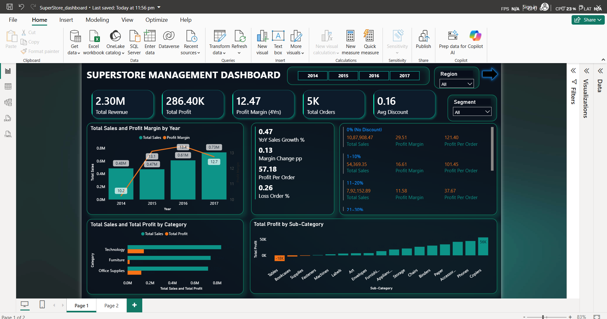
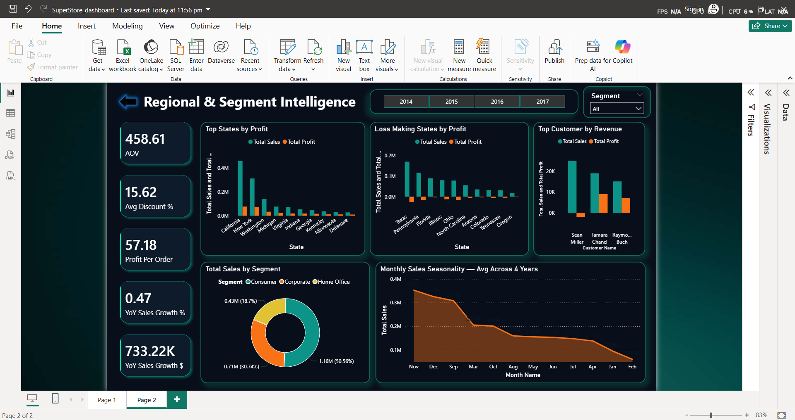

# Superstore Sales Dashboard (Power BI)

## Project Overview
This project analyzes Superstore sales data to understand revenue trends, profit performance, and customer segments using Power BI.

The dashboard helps identify:
- Sales performance by year
- Profit trends
- Sales by category and sub-category
- Customer segment contribution
- Discount impact on profit

---

## Dashboard Preview

### Page 1

### Page 2

---

## Dataset
Sample Superstore Dataset

---

## Tools Used
- Power BI
- Data Visualization
- Business Analysis

---

## Key Insights
- Technology category generated the highest sales.
- Tables sub-category resulted in the biggest loss.
- Sales increased from 2014 to 2017.
- High discounts negatively impacted profit margins.

---
## Author
Sudip Kumar Jena
## Author
Sudip Kumar
